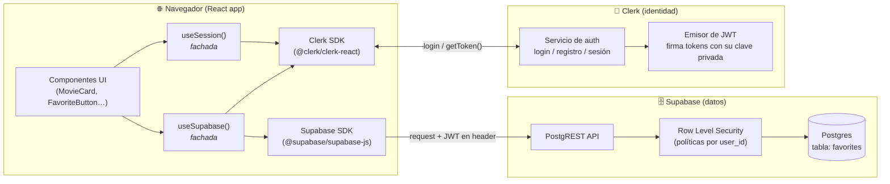
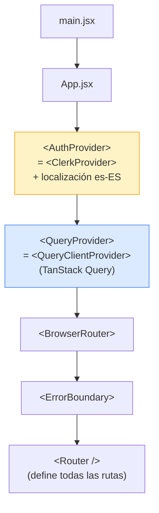
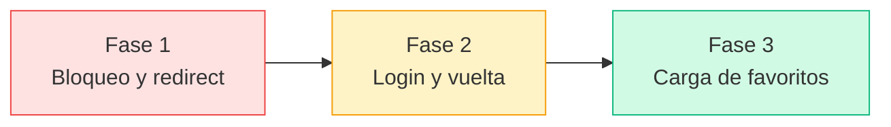
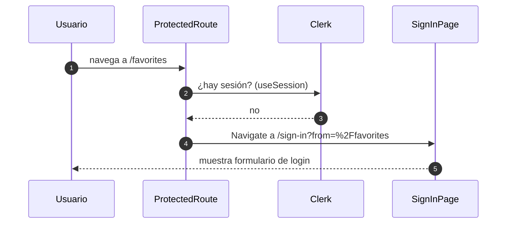
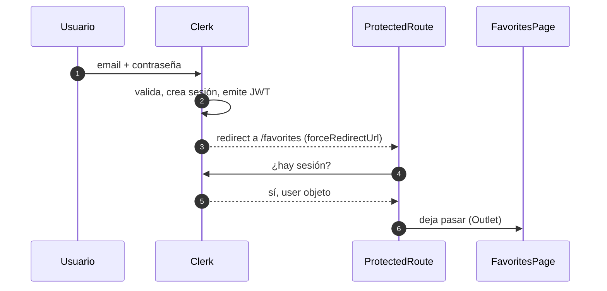
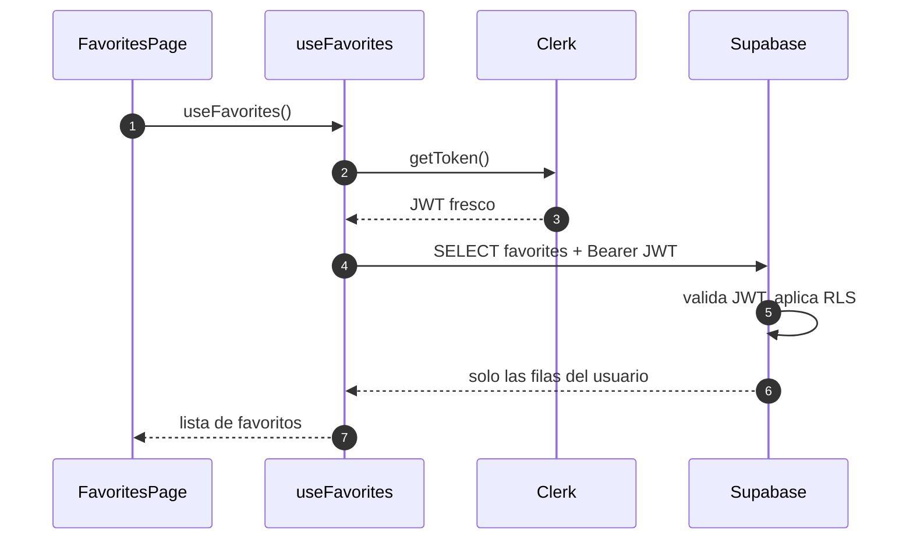
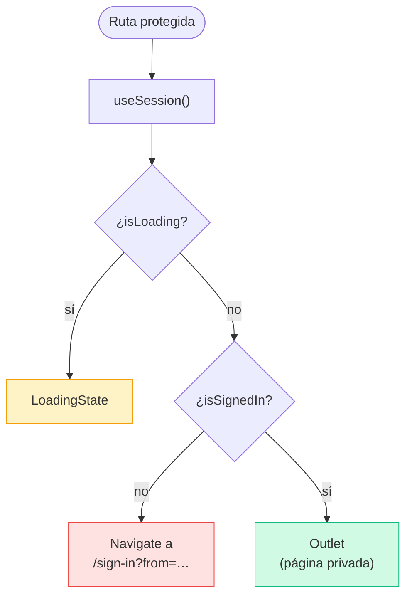
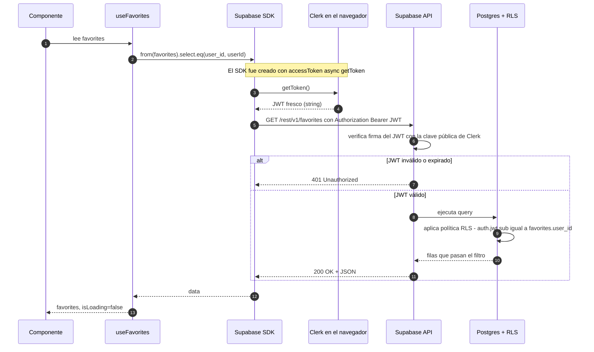

# Flujo de autenticación — Clerk + Supabase

Este documento explica, paso a paso y con diagramas, cómo funciona la
autenticación en Movix. La decisión clave es que **usamos dos proveedores
distintos**:

- **Clerk** = identidad (quién eres). Maneja registro, login, sesiones, JWT.
- **Supabase** = datos personales (qué te pertenece). Guarda favoritos y
  ratings en una tabla con `user_id`.

El "pegamento" entre los dos es un **JWT que Clerk firma** y que **Supabase
valida** antes de devolver datos. Toda la magia está en ese token.

---

## Tabla de contenidos

- [1. Vista de alto nivel](#1-vista-de-alto-nivel)
- [2. Arranque de la app: providers](#2-arranque-de-la-app-providers)
- [3. ¿Por qué dos proveedores y no solo uno?](#3-por-qué-dos-proveedores-y-no-solo-uno)
- [4. Flujo completo: usuario anónimo intenta entrar a /favorites](#4-flujo-completo-usuario-anónimo-intenta-entrar-a-favorites)
- [5. ProtectedRoute: decisión paso a paso](#5-protectedroute-decisión-paso-a-paso)
- [6. Cómo cada petición a Supabase se autentica](#6-cómo-cada-petición-a-supabase-se-autentica)
- [7. Glosario rápido](#7-glosario-rápido)
- [8. Ficheros implicados](#8-ficheros-implicados)

---

## 1. Vista de alto nivel

Antes de los flujos, una foto fija de quién habla con quién:

**Lectura rápida:**

- Los componentes **nunca** hablan con Clerk ni con Supabase directamente.
  Pasan siempre por dos hooks-fachada: `useSession()` y `useSupabase()`.
- Clerk firma el JWT con su clave privada. Supabase tiene configurada la
  clave pública de Clerk en su dashboard y por eso confía en esos tokens.
- Las políticas RLS de la tabla `favorites` comparan el `user_id` de cada
  fila con el `sub` (subject) del JWT → un usuario solo ve lo suyo.

---

## 2. Arranque de la app: providers

Cuando la app arranca (`main.jsx` → `App.jsx`), se montan **tres providers
anidados** en este orden exacto:

¿Por qué **Clerk va el más externo**? Porque tanto el router como cualquier
hook de TanStack Query van a necesitar saber si hay sesión y poder pedir un
token. Si `ClerkProvider` estuviera por dentro, esos hooks fallarían al
arrancar (no encontrarían el contexto de Clerk).

> 📄 Ver: `src/app/App.jsx`, `src/app/providers/AuthProvider.jsx`

---

## 3. ¿Por qué dos proveedores y no solo uno?

Es legítimo preguntárselo — Supabase tiene su propio sistema de auth
(`supabase.auth`). ¿Por qué no usarlo y ahorrarse Clerk?

| Decisión       | Ventaja                                                                |
| -------------- | ---------------------------------------------------------------------- |
| Clerk = auth   | UI de login/registro ya construida y traducida; magic links, 2FA, etc. |
| Supabase = DB  | Postgres real con RLS — perfecto para guardar favoritos por usuario.   |
| **Separación** | Si mañana cambiamos de DB, la identidad sigue intacta (y al revés).    |

El **enlace** entre ambos es el campo `user_id` de la tabla `favorites`:
guarda el `clerkUserId` (un string tipo `user_2abc…`). Las políticas RLS de
Supabase comparan ese campo con el `sub` del JWT que llega en cada request.

---

## 4. Flujo completo: usuario anónimo intenta entrar a `/favorites`

Es el camino "feliz" más largo. Para que sea digerible lo dividimos en
**tres fases independientes** — cada una resuelve un problema concreto:

---

### Fase 1 — La app bloquea el acceso y redirige al login

- `ProtectedRoute` envuelve cada ruta privada y pregunta a Clerk vía
  `useSession()`. Si no hay sesión, redirige.
- El `from=%2Ffavorites` lleva codificada la ruta original (con
  `encodeURIComponent`) para poder volver a ella tras el login.

---

### Fase 2 — El usuario se loguea y Clerk lo devuelve a la ruta original

- `SignInPage` le pasa al componente `<SignIn>` de Clerk
  `forceRedirectUrl="/favorites"` (leído del `?from=…`). Clerk se
  encarga solo de volver al sitio original.
- `ProtectedRoute` se vuelve a montar tras el redirect — esta vez
  `useSession` ya devuelve `isSignedIn: true` y `<Outlet />` deja pasar
  a `FavoritesPage`.

---

### Fase 3 — La página carga los favoritos desde Supabase

- `useFavorites` → `useSupabase` → cliente Supabase memoizado por
  `userId`. Si cambias de cuenta, se recrea solo.
- El SDK llama a `getToken()` **en cada request** (no una vez al
  arrancar): si Clerk rota el token, la siguiente petición ya lleva
  el nuevo.
- La política RLS de la tabla `favorites` compara
  `auth.jwt() ->> 'sub'` con `favorites.user_id` → el usuario solo ve
  lo suyo, aunque el frontend pidiera todo.

> 📄 Ver: `src/shared/components/layout/ProtectedRoute.jsx`,
> `src/features/auth/pages/SignInPage.jsx`,
> `src/api/useSupabase.js`,
> `src/features/favorites/hooks/useFavorites.js`

---

## 5. `ProtectedRoute`: decisión paso a paso

Esta es la lógica que decide si te deja pasar a una página privada.
Vive en `src/shared/components/layout/ProtectedRoute.jsx` y son **15
líneas**, pero pasa por tres estados que conviene tener claros:

**Tres detalles importantes:**

- **`isLoading` no es lo mismo que "no autenticado"**. Cuando Clerk aún no
  ha respondido, no podemos asumir que el usuario no tiene sesión —
  redirigir aquí causaría un parpadeo (loginscreen flash) que se vería
  feo cada vez que recargas una página privada.
- **`replace` en `<Navigate>`** evita que el historial del navegador se
  llene de páginas privadas. Si pulsas "atrás" después de loguearte, no
  vuelves a la pantalla de login; vuelves a donde estabas antes.
- **El `from` se codifica con `encodeURIComponent`** porque puede contener
  `/`, `?`, `&` u otros caracteres que romperían la URL.

---

## 6. Cómo cada petición a Supabase se autentica

Esta es probablemente la parte más "mágica" y la que vale la pena entender
bien. Cada vez que llamas a `supabase.from('favorites').select()` pasa
esto por debajo:

**Las dos cosas no obvias:**

1. **`accessToken: async () => getToken()` es la integración nativa
   Clerk↔Supabase.** Antes (pre-abril 2025) había que crear un "JWT
   Template" en Clerk y configurarlo a mano. Ahora basta con pasarle la
   función `getToken` de Clerk al crear el cliente. El SDK la llama **en
   cada request**, así que si Clerk rota el token mientras estás usando
   la app, la siguiente petición ya lleva el token nuevo.

2. **Por eso `useSupabase` memoiza el cliente por `userId`**, no por
   nada más. El `getToken` siempre es el mismo objeto en memoria; lo que
   cambia es a quién devuelve token. Si cambias de cuenta (logout +
   login con otra), `userId` cambia, `useMemo` se recalcula y se crea
   un cliente nuevo. Esto evita que un cliente "viejo" siga devolviendo
   tokens de la cuenta anterior.

> 📄 Ver: `src/api/supabase.client.js`, `src/api/useSupabase.js`

---

## 7. Glosario rápido

| Término             | Qué es                                                                                          |
| ------------------- | ----------------------------------------------------------------------------------------------- |
| **JWT**             | "JSON Web Token". Un string firmado que prueba quién eres sin tener que revalidar contraseña.   |
| **`sub`** del JWT   | "subject" — el ID del usuario dueño del token. En Clerk es el `clerkUserId` (`user_2abc…`).     |
| **RLS**             | "Row Level Security" — políticas SQL que filtran filas según quién pregunta. Vive en Postgres.  |
| **Clave publishable** de Clerk | Clave que va en el frontend. **No** firma tokens; solo identifica la app ante Clerk. |
| **anon key** de Supabase | Clave que va en el frontend. **No** salta RLS; con ella solo ves lo que RLS deje ver.      |
| **Fachada** (hook)  | Hook que envuelve otro SDK para que el resto del código no dependa directamente de él.          |

---

## 8. Ficheros implicados

| Fichero                                                  | Rol                                                                  |
| -------------------------------------------------------- | -------------------------------------------------------------------- |
| `src/app/App.jsx`                                        | Monta los providers en orden.                                        |
| `src/app/providers/AuthProvider.jsx`                     | Envuelve la app con `<ClerkProvider>` y la localización española.    |
| `src/config/envConfig.js`                                | Lee y valida `VITE_CLERK_PUBLISHABLE_KEY`, `VITE_SUPABASE_*`.        |
| `src/features/auth/hooks/useSession.js`                  | Fachada de Clerk → devuelve `{ user, isLoading, isSignedIn }`.       |
| `src/features/auth/pages/SignInPage.jsx`                 | Monta `<SignIn>` de Clerk, lee `?from=...` y configura el redirect.  |
| `src/features/auth/pages/SignUpPage.jsx`                 | Igual pero para registro.                                            |
| `src/shared/components/layout/ProtectedRoute.jsx`        | Decide loading / redirect / outlet.                                  |
| `src/api/supabase.client.js`                             | `createSupabaseClient(getToken)` — cliente con `accessToken` nativo. |
| `src/api/useSupabase.js`                                 | Hook que crea el cliente Supabase memoizado por `userId`.            |
| `src/features/favorites/hooks/useFavorites.js`           | Ejemplo de consumo: TanStack Query + Supabase autenticado.           |
| `src/features/favorites/services/favorites.service.js`   | CRUD puro sobre la tabla `favorites`.                                |
