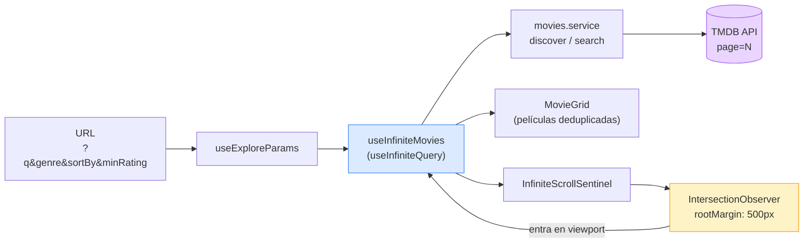
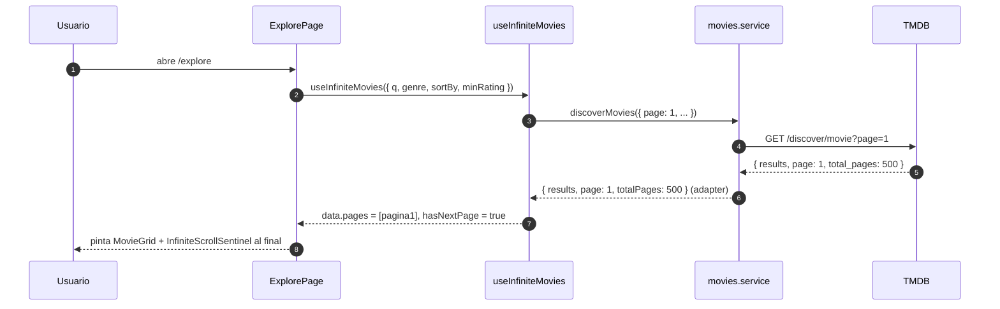
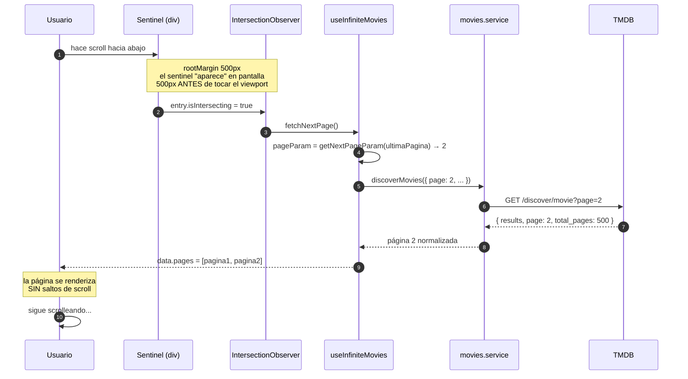
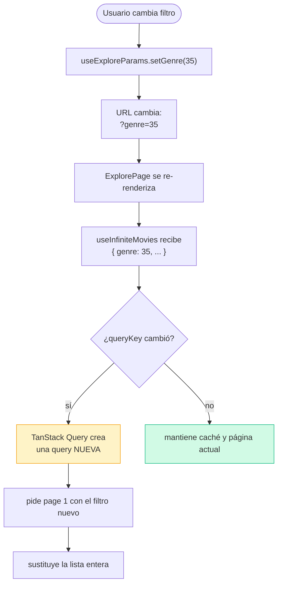

# Flujo del scroll infinito

Este documento explica cómo Movix carga películas en `/explore` a medida
que el usuario hace scroll, sin botón de "siguiente página" y sin
recargar.

La pieza no obvia: **no escuchamos el evento `scroll` del navegador**.
Usamos un `IntersectionObserver` sobre un elemento centinela invisible
que vive al final de la lista. Cuando ese centinela entra en pantalla,
pedimos la siguiente página. Esto es más eficiente y más declarativo que
calcular posiciones de scroll a mano.

---

## Tabla de contenidos

- [1. Vista de alto nivel](#1-vista-de-alto-nivel)
- [2. Primera carga (página 1)](#2-primera-carga-página-1)
- [3. Carga incremental al hacer scroll](#3-carga-incremental-al-hacer-scroll)
- [4. Reset cuando cambian los filtros o la búsqueda](#4-reset-cuando-cambian-los-filtros-o-la-búsqueda)
- [5. Decisiones clave (FAQ técnica)](#5-decisiones-clave-faq-técnica)
- [6. Ficheros implicados](#6-ficheros-implicados)

---

## 1. Vista de alto nivel

Quién habla con quién:



**Lectura rápida:**

- **La URL es la fuente de verdad** de los filtros (no `useState`). Si
  copias la URL y la abres en otra pestaña, ves exactamente la misma
  lista.
- **`useInfiniteMovies`** envuelve `useInfiniteQuery` de TanStack Query
  y guarda todas las páginas cargadas en un único array de `pages`.
- **El sentinel** es un `<div>` invisible al final del grid. Cuando el
  scroll lo acerca a la pantalla, dispara `fetchNextPage()`.

---

## 2. Primera carga (página 1)



**Qué pasa por debajo:**

- `useInfiniteMovies` decide si llamar a `discoverMovies` o a
  `searchMovies` mirando si `q` tiene texto (`isSearchMode`). Para el
  usuario es el mismo hook; debajo son dos endpoints distintos de TMDB.
- El **adapter** (`mapTmdbPaginatedResponse` + `mapTmdbMovieToMovie`)
  traduce los nombres feos de TMDB (`poster_path`, `vote_average`,
  `total_pages`) al modelo interno limpio (`poster`, `rating`,
  `totalPages`). Los componentes nunca ven la forma cruda de TMDB.
- `getNextPageParam` mira `lastPage.page < lastPage.totalPages`. Si
  estamos en la página 1 de 500, devuelve `2` → eso es el `pageParam`
  de la siguiente llamada. Cuando ya no hay más, devuelve `undefined`
  y `hasNextPage` pasa a `false`.

---

## 3. Carga incremental al hacer scroll

Este es el corazón del scroll infinito. El usuario sigue bajando y, sin
intervención suya, aparecen más películas.



**Tres detalles importantes:**

1. **`rootMargin: 500px`** (en `InfiniteScrollSentinel.jsx`) hace que
   el observer considere al sentinel "visible" cuando aún está 500px
   por debajo del viewport. Así pedimos la siguiente página **antes**
   de que el usuario llegue al final → el infinite scroll se siente
   instantáneo, sin esperas.

2. **Guard contra peticiones dobles.** El observer solo está activo si
   `hasNextPage && !isFetching`. Esto se controla con el tercer
   argumento `enabled` de `useIntersectionObserver`:

   ```js
   useIntersectionObserver(onIntersect, { rootMargin: '500px' },
     hasNextPage && !isFetching);
   ```

   Sin ese guard, el sentinel podría dispararse varias veces seguidas
   mientras la primera petición aún está en vuelo, y pedirías la misma
   página 2–3 veces.

3. **Dedupe por `id`.** TMDB a veces devuelve la misma película en dos
   páginas distintas (porque la paginación se basa en orden cambiante).
   `ExplorePage` aplana las páginas y deduplica antes de pintar:

   ```js
   const allMovies = data
     ? Array.from(
         new Map(
           data.pages.flatMap((p) => p.results).map((m) => [m.id, m])
         ).values()
       )
     : [];
   ```

   El `Map` se queda con la última ocurrencia de cada `id` y
   `Array.from(...values())` lo convierte de vuelta en array.

---

## 4. Reset cuando cambian los filtros o la búsqueda

Si el usuario va por la página 5 de "Acción" y cambia el género a
"Drama", **no queremos** seguir pidiendo la página 6 de acción. Queremos
empezar de cero con Drama.

Lo bonito: **no escribimos código de reset**. TanStack Query lo hace
solo, gracias al `queryKey`.



**El `queryKey` es la clave (literal):**

```js
queryKey: ['movies', 'infinite', { query, genre, sortBy, minRating }]
```

Cualquier cambio en `query`, `genre`, `sortBy` o `minRating` genera una
**clave diferente** → TanStack Query trata eso como una query distinta,
no recicla las páginas anteriores, y dispara de nuevo desde
`pageParam = 1`. La caché de la combinación anterior queda guardada
unos minutos por si el usuario vuelve a ella.

> ⚠️ Si añades un nuevo filtro y olvidas meterlo en el `queryKey`,
> tendrás un bug raro: la URL dice una cosa pero la lista no se
> actualiza. **Regla:** todo lo que afecta a la query va en el
> `queryKey`.

---

## 5. Decisiones clave (FAQ técnica)

Preguntas que suelen caer en defensas y entrevistas, con la respuesta
ya pensada:

**P: ¿Por qué `IntersectionObserver` y no un listener de `scroll`?**
R: El evento `scroll` se dispara decenas de veces por segundo y obliga
a hacer cálculos manuales (`getBoundingClientRect`, comparar con
`window.innerHeight`…). `IntersectionObserver` es declarativo, asíncrono
y el navegador lo optimiza. Solo te avisa cuando la condición cambia.

**P: ¿Por qué `useInfiniteQuery` y no un `useState` + `useEffect` que
acumule páginas?**
R: Tendrías que reimplementar a mano: caché, dedupe de peticiones en
vuelo, cancelación al desmontar, retries, invalidación al cambiar
filtros, sincronización entre pestañas… Todo eso ya está en TanStack
Query y es batería incluida.

**P: ¿Qué pasa si el usuario abre `/explore?q=batman&genre=28`
directamente?**
R: Funciona. Los filtros viven en la URL (`useExploreParams` los lee
con `useSearchParams`). La primera carga ya respeta esos filtros porque
están en el `queryKey` desde el render inicial.

**P: ¿Y si TMDB devuelve un error en la página 3?**
R: TanStack Query reintenta automáticamente (con backoff). Si el error
persiste, `isFetchingNextPage` se queda en `false` y `error` se
actualiza. Las páginas 1 y 2 ya cargadas **siguen visibles** — el error
no borra lo que tenías. El usuario puede seguir viendo lo que ya
descargó y reintentar.

**P: ¿Cómo se sabe cuándo parar?**
R: `getNextPageParam` devuelve `undefined` cuando
`lastPage.page === lastPage.totalPages`. Eso pone `hasNextPage` a
`false`. El sentinel deja de observar (`enabled` pasa a `false`) y
renderiza `<EndOfResults />` en lugar del spinner.

**P: ¿Por qué `rootMargin: 500px` y no `0`?**
R: Para precargar. Con `0`, el sentinel solo dispara cuando *toca* el
viewport — el usuario verá un instante de "espera". Con `500px`,
empezamos a pedir cuando el sentinel está a 500px de aparecer, y
normalmente la página nueva ya está cargada cuando llega.

---

## 6. Ficheros implicados

| Fichero                                                              | Rol                                                                   |
| -------------------------------------------------------------------- | --------------------------------------------------------------------- |
| `src/features/movies/pages/ExplorePage.jsx`                          | Compone filtros + grid + sentinel. Aquí vive el dedupe por `id`.      |
| `src/features/movies/hooks/useMovies.js`                             | `useInfiniteMovies` — envuelve `useInfiniteQuery`.                    |
| `src/features/movies/hooks/useExploreParams.js`                      | Lee y escribe filtros en la URL (`useSearchParams`).                  |
| `src/features/movies/services/movies.service.js`                     | `discoverMovies` y `searchMovies` — llaman a TMDB.                    |
| `src/features/movies/adapters/tmdbMovie.adapter.js`                  | Traduce la forma de TMDB al modelo interno.                           |
| `src/features/movies/components/InfiniteScrollSentinel.jsx`          | El `<div>` observado + spinner/end-of-results.                        |
| `src/shared/hooks/useIntersectionObserver.js`                        | Hook genérico que envuelve `IntersectionObserver`.                    |
| `src/shared/components/feedback/InlineSpinner.jsx`                   | Spinner que se ve durante `isFetchingNextPage`.                       |
| `src/shared/components/feedback/EndOfResults.jsx`                    | Mensaje "no hay más resultados" cuando `!hasNextPage`.                |
